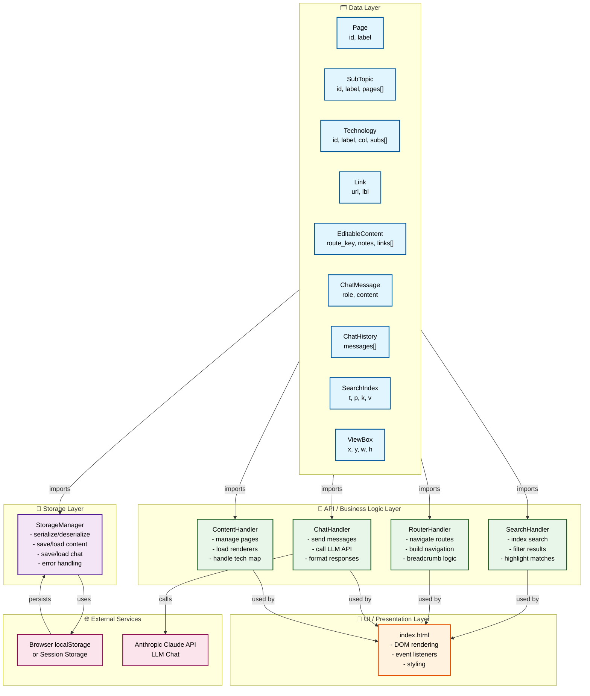

## Architecture Overview

**File Structure:**
```
net-hub/
├── network_entities.py       # 🗂️ Pure data models (9 classes)
├── storage_manager.py        # 💾 Persistence layer (JSON serialization)
├── search_handler.py         # 🔍 Search & indexing (next)
├── router_handler.py         # 🛣️ Navigation & routing (next)
├── chat_handler.py           # 💬 AI chat interactions (next)
├── content_handler.py        # 📄 Page rendering logic (next)
├── architecture.md           # 📋 This diagram
└── index.html                # 🎨 UI layer (no business logic)
```

## Key Principles

✅ **Separation of Concerns** - Each layer has single responsibility  
✅ **No Circular Dependencies** - Data layer imports nothing, UI imports all  
✅ **Loose Coupling** - Layers communicate via data objects only  
✅ **Testability** - Each handler can be tested independently  
✅ **Scalability** - New features go into new files, not existing ones  

---

## 📁 Files Created So Far

| File | Status | Purpose |
|------|--------|---------|
| `network_entities.py` | ✅ Uploaded | 9 dataclasses (Page, Technology, ChatHistory, etc.) |
| `storage_manager.py` | ✅ Uploaded | JSON serialization + localStorage abstraction |

**Next Steps:**
1. `search_handler.py` - Search indexing & filtering
2. `router_handler.py` - Navigation & breadcrumb logic
3. `chat_handler.py` - LLM API interactions
4. `content_handler.py` - Page rendering & tech maps

Ready to build the next layer? 🚀
